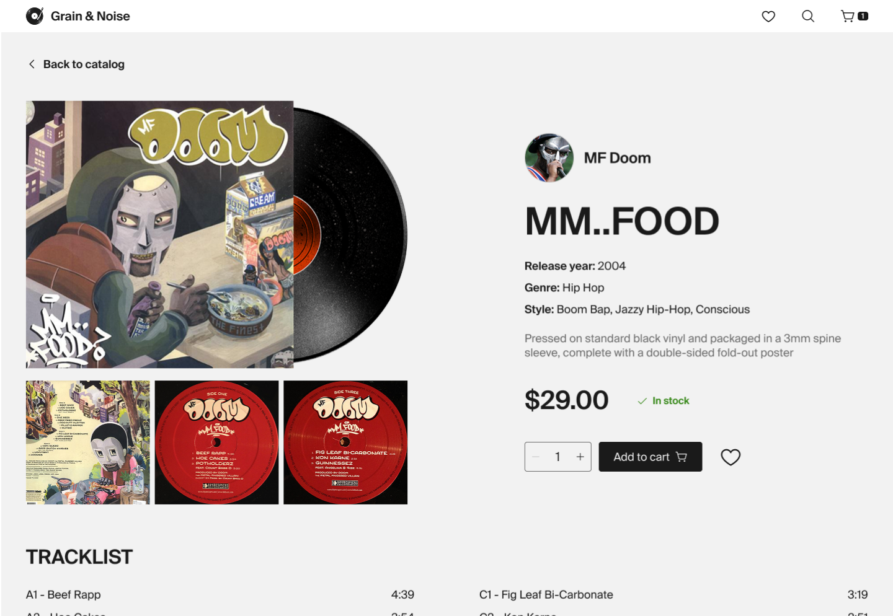

# Grain & Noise — React + TypeScript Vinyl Store

A full-stack e-commerce demo that simulates a vinyl store experience: product catalog browsing, genre and price filtering, sorting, wishlist management, cart operations, and product details.

The project is built to demonstrate production-oriented frontend architecture with typed React, reusable hooks, service-layer separation, and strong UI testing practices.

**Live demo:** https://vinyl-shop-project.netlify.app/  
**Issues:** https://github.com/dee-diaz/shopping-cart/issues



---

## Table of Contents

- [Features](#features)
- [Tech Stack](#tech-stack)
- [Architecture](#architecture)
- [Project Structure](#project-structure)
- [Local Setup](#local-setup)
- [Environment Variables](#environment-variables)
- [Available Scripts](#available-scripts)
- [Testing](#testing)
- [Accessibility](#accessibility)
- [Future Improvements](#future-improvements)

---

## Features

### Storefront Experience

- Catalog page with featured albums and genre-based browsing
- URL-synced filters for a shareable/searchable state
- Sorting controls for product discovery
- Product detail page with tracklist and metadata

### User Flows

- Add/remove items in cart
- Quantity updates in cart
- Wishlist toggle and dedicated wishlist page
- Empty/loading/error states for resilient UX

### API Integration

- Frontend fetches album data through a backend proxy
- Backend integrates with Discogs API
- In-memory caching on backend to reduce repeated upstream calls

---

## Tech Stack

### Frontend

- **React 19**
- **TypeScript**
- **React Router 7**
- **Vite**
- **CSS Modules**
- **Vitest + Testing Library**
- **ESLint + Prettier**

### Backend

- **Node.js**
- **Express**
- **CORS**
- **dotenv**
- **Discogs API**

---

## Architecture

### State Management

Global UI state is split into domain-specific contexts:

- `AlbumsContext` — catalog data, loading/error state, sort state
- `CartContext` — cart items and cart updates
- `WishlistContext` — wishlist items and wishlist updates

This keeps responsibilities isolated and components focused.

### Reusable Hooks

- `useLoadAlbums(searchParams)` — loads featured or genre-specific catalog data
- `useLoadAlbum(id)` — loads single product details with loading/error handling
- `useGenreFilters()` — syncs selected genres with URL query params

### Service Layer

Data logic is separated from rendering:

- `catalogService` for network/data access
- `filterService` and `sortService` for list transformations
- `priceService` for price formatting/transforms

This improves testability and reduces component complexity.

---

## Project Structure

```bash
shopping-cart/
├── frontend/
│   ├── src/
│   │   ├── components/
│   │   ├── constants/
│   │   ├── contexts/
│   │   ├── data/
│   │   ├── hooks/
│   │   ├── routes/
│   │   ├── services/
│   │   └── types/
│   └── tests/
└── backend/
    └── server.js
```

---

## Local Setup

### Prerequisites

- Node.js 18+ (Node 20+ recommended)
- npm

### 1) Clone and install

```bash
git clone https://github.com/dee-diaz/shopping-cart.git
cd shopping-cart

cd frontend && npm install
cd ../backend && npm install
```

### 2) Configure environment variables

Create `.env` in `backend/`:

```bash
DISCOGS_TOKEN=your_discogs_token
PORT=3000
```

Create `.env` in `frontend/` (optional for local defaults):

```bash
VITE_API_URL=http://localhost:3000
```

### 3) Run backend

```bash
cd backend
npm run dev
```

### 4) Run frontend

```bash
cd frontend
npm run dev
```

Frontend runs on Vite default port (usually `5173`), backend on `3000` unless overridden.

---

## Environment Variables

### Backend (`backend/.env`)

- `DISCOGS_TOKEN` — required Discogs API token
- `PORT` — API server port (default: `3000`)

### Frontend (`frontend/.env`)

- `VITE_API_URL` — backend base URL (default fallback in code: `http://localhost:3000`)

---

## Available Scripts

### Frontend

```bash
npm run dev      # start Vite dev server
npm run build    # production build
npm run preview  # preview built app
npm run lint     # run ESLint
npm run test     # run Vitest
```

### Backend

```bash
npm run dev      # start backend with nodemon
npm run start    # start backend with node
```

---

## Testing

The project includes extensive component and route-level UI tests using Vitest and Testing Library.

Covered areas include:

- Rendering behavior and content
- Interaction flows (cart, wishlist, filters, sorting)
- Context-driven and route-driven behavior
- Loading/error/empty UI states
- Accessibility-oriented queries and roles

Run tests:

```bash
cd frontend
npm test -- --run
```

---

## Accessibility

The UI includes accessibility-focused patterns:

- Semantic headings and layout regions
- ARIA attributes (`aria-label`, `aria-expanded`, `aria-selected`)
- Grouped controls (`role="group"`)
- Keyboard support in interactive controls
- Live regions for quantity updates

---

## Future Improvements

- Persist cart/wishlist (localStorage or backend)
- Add backend rate limiting and cache TTL strategy
- Add integration/e2e tests (Playwright/Cypress)
- Add error boundaries and richer fallback UIs
- Add i18n and improved mobile-first refinements

---

If you’re reviewing this project for hiring purposes, I’d be happy to walk through architecture decisions, trade-offs, and testing strategy.
